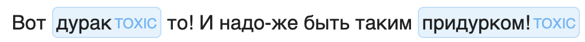

  

# RuBert NER Toxicity

Fine-tuning cointegrated/rubert-tiny-toxicity model on data from toxic_dataset_ner.



```python
from ipymarkup import show_span_box_markup

from transformers import (
    AutoTokenizer, 
    AutoModelForTokenClassification, 
    pipeline
)

model = AutoModelForTokenClassification.from_pretrained('tesemnikov-av/rubert-ner-toxicity')
tokenizer = AutoTokenizer.from_pretrained('tesemnikov-av/rubert-ner-toxicity')

pipe = pipeline(model=model, tokenizer=tokenizer, task='ner', aggregation_strategy='average')

text = "Вот дурак то! И надо-же быть таким придурком!"
spans = pipe(text.lower())

spans_list = []
for span in spans:
    spans_list.append((span['start'], span['end'], span['entity_group']))
    
show_span_box_markup(text, spans_list)
```
